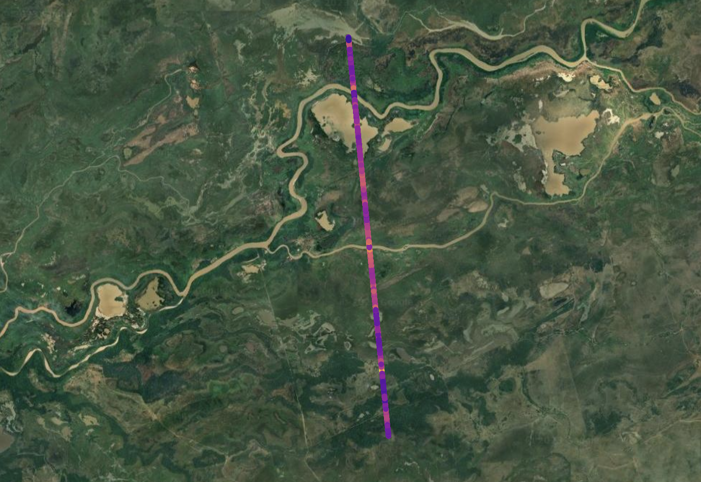
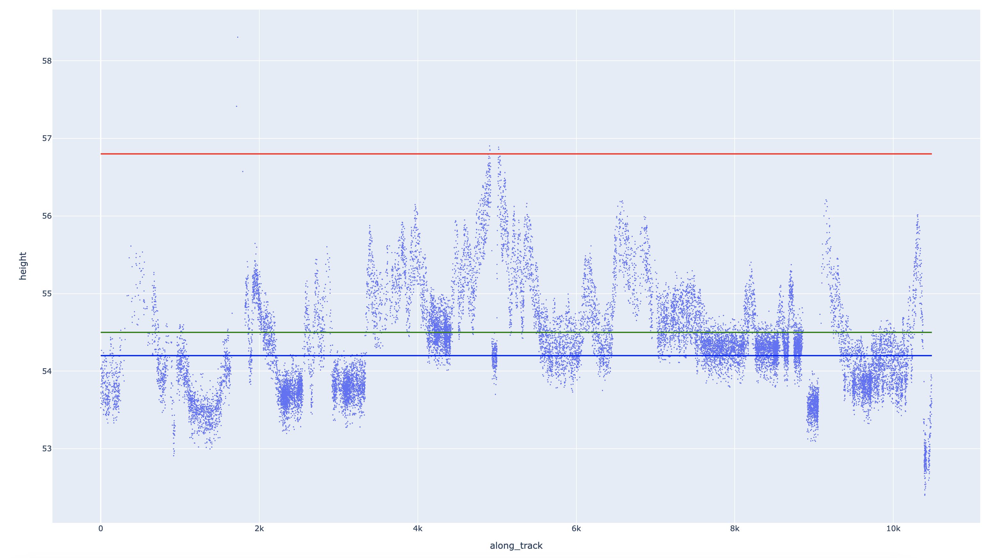

# README

## Table of Contents
1. [Project Overview](#project-overview)
2. [Installation](#installation)
3. [Usage](#usage)
4. [Troubleshooting](#troubleshooting)
5. [License](#license)
6. [Contact](#contact)

## Project Overview

This repository contains the code and data associated with the manuscript "Rules of River Avulsion Change Downstream". The codebase is primarily written in Python and zsh and it uses a variety of scientific computing libraries.

### Dependencies

We used Python 3.9.6 to develop the codebase. It is recommended that you use a virtual environment to run the code. We prefer PyEnv. To install PyEnv, run the following command:

```zsh
curl https://pyenv.run | zsh
```

*note: zsh commands can be replaced with bash commands*

The project uses several Python libraries, including but not limited to:

- numpy
- matplotlib
- geopandas
- PyQt5
- scipy
- scikit-image
- rasterio
- shapely
- pysheds
- plotly-express
- pyarrow
- nbformat
- earthengine-api
- geemap
- pycrs
- seaborn
- xgboost
- scikit-learn
- openpyxl
- scikit-optimize

The specific versions of these dependencies are listed in the [`pyproject.toml`](pyproject.toml) file. The project uses [Poetry](https://python-poetry.org/) to manage dependencies. To install Poetry, run the following command:

```zsh
curl -sSL https://install.python-poetry.org | python -
```

This will install Poetry on your system.

## Installation

First, clone the repository using the following command:

```zsh
git clone https://github.com/jameshgrn/rulesofriveravulsion
```

### Data Download

The data utilized in the manuscript can be accessed via our [Zenodo repository](https://zenodo.org/records/10338686). The data is compressed into a zip file and needs to be downloaded and relocated to the [`data/avulsion_data`](data/avulsion_data/) directory. 

The `curl` and `unzip` commands can be used in your terminal to download and decompress the data. The following is an illustration of how this can be accomplished:

```zsh
curl -L https://zenodo.org/records/10338686 -o data.zip
unzip data.zip -d data/avulsion_data/
```

This will download the zip file from the Zenodo repository and unzip it into the `data/avulsion_data/` directory.

Navigate to the `rulesofriveravulsion` directory and run the following command to install the project dependencies:

```zsh
poetry install
```

To activate the virtual environment created by Poetry, use the following command:

```zsh
poetry shell
```

Now you are ready to run the scripts in this repository.

## Usage

### Structure

The codebase is organized into several directories:

- `figure_plotting`: Contains scripts for generating figures for the manuscript. Necessary data cleaning is done with [`figure_plotting/reproduce_figs.py`] which should be run before any other figure plotting routine. [`Figure1.py`](figure_plotting/Figure1.py) plots figure 1, [`Figure2.py`](figure_plotting/Figure2.py) plots figure 2, [`Figure3.py`](figure_plotting/Figure3.py) plots figure 3, and [`Figure4_interactive.py`](figure_plotting/Figure4_interactive.py) starts the interactive demonstration of figure 4 (see the [Figures](#figures) section for more information). Plotted figures from the main text are placed into the [`figure_plotting/figures`](figure_plotting/figures) apart from the results of [`figure_plotting/Figure4_interactive.py`](figure_plotting/Figure4_interactive.py) which are placed into [`figure_plotting/figures/figure4`](figure_plotting/figures/figure4). Extended data figures are placed into [`figure_plotting/figures/extended_data_figs`](figure_plotting/figures/extended_data_figs).  

- `data`: Contains the data used in the manuscript. ['data/avulsion_data'](data/avulsion_data) contains the raw data files (after downloading and unzipping) that must be used to recreate the plots and analyses from the manuscript. Data used to train, validate, and use the BASED model are located in ['data/BASED_model'](data/BASED_model). Data for extended data figures is in ['data/extended_data_figure_data'](data/extended_data_figure_data). Data for figures 2-4 are included in both ['data/figure2_data'](data/figure2_data) and ['data/figure4_data'](data/figure4_data). Supplementary data tables submitted with the manuscript are located in ['data/manuscript_data'](data/manuscript_data).

- `based`: Contains the codes required to train and validate for the BASED model.

### Data Structure
In the avulsion_data, each avulsion location has a designated folder. Within this folder are several files:
-cross sections are **always** denoted by an underscore and number (e.g., '_1') followed by either a `.geojson`, `.feather`, or `.gpkg` extension.
- For cross sections measured with FABDEM, the file extension is `.geojson` for the vector data and `.csv` for the flatfile data.
-ICESat-2 data was used for $\beta$ and $\gamma$ data collection, water surface elevation measurement, and validation. For cross sections measured with ICESat-2, the specific measurements used a particular ICESat-2 trackline is denoted in the filename by the strings 'data', 'water', and/or 'val'. All ICESat-2 tracklines contain the string 'UID', standing for unique identifier. All ICESat-2 tracklines utilize the `.feather`, or `.gpkg` extensions.
-Validation cross sections, both with separate vectors and flatfiles, are denoted by the string 'val'.
-Each avulsion location folder also includes a .tif file, which is the FABDEM raster for that location. 
-Each avulsion location folder contains all the ICESat-2 data downloaded for that location. These `.feather` files contain the avulsion name, the string 'data' and **do not have a number at the end of the filename.** 
-Supplementary Table 1 contains the normalized distance data for all 174 cross sections used in figure 1.
-Supplementary Table 2 serves as the master document for the project. Light blue color denotes ICESat-2 was used for that particular measurement. [`data/manuscript_data/datadictionary_supplement.txt`](data/manuscript_data/datadictionary_supplement.txt) serves as a dictionary for the machine-readable column names in this table and others.
- Supplementary Table 3 contains the validation data for extended data figure 2.

### Running the Scripts

It is important to run the files in order. A helper zsh script is provided for this, to use it, execute the following command:

```zsh
poetry run zsh plot_figures.zsh
```

Currently, the BASED model is commented out of the zsh script. To fully train the BASED model, you can uncomment the line in the zsh script. Note that the BASED model may require a separate environment due to the dated dependencies of the scikit-optimize library. However, models, data, and results are provided in the `based` directory.

### Figures

After running the `plot_figures.zsh` script, the plotting elements will be saved in the `figures` directory. Extended data figures are saved in the `figures/extended_data` directory.

Figure 4 is demonstrated interactively; run the command:

```zsh
poetry run python figure_plotting/Figure4_interactive.py
```
will open a GUI that allows you to load a DEM and GeoJSON file and perform a random walk simulation on the DEM using a PyQt5 application for visualizing and interacting with Digital Elevation Models (DEMs), GeoJSON files, and the softmax random walk:


#### Main Features

1. **Load DEM**: This button allows you to load a Digital Elevation Model (DEM) in .tif format. The DEM is displayed as a grayscale image.

2. **Load GeoJSON**: This button allows you to load a GeoJSON file. The GeoJSON data is clipped to the extent of the loaded DEM and displayed on top of it.

3. **Load Lat/Lon**: This button allows you to load a GeoJSON file containing a single Point geometry. The point's coordinates are used as the starting point for the random walk.

4. **Start Random Walk**: This button initiates a random walk simulation from the selected starting point. The parameters for the random walk (theta, alpha, beta, number of steps, number of trials, threshold percentage, and sigma) can be adjusted in the provided input fields.

5. **Save Plot**: This button allows you to save the current plot as a .png or .jpeg image.

6. **Reset**: This button clears the current selection and resets the plot.

7. **Save Random Walker Cloud**: This button allows you to save the result of the random walk simulation as a GeoTIFF file.

*note: threshold pct over and sigma both control the visualization in figure 4. Threshold pct over controls the normalized visitation frequency threshold that gets plotted, default is 0.05. sigma controls the blending/smoothing kernel radius of the visualization. Additionally, this script assumes that the DEM and the GeoJSON files are in the same Coordinate Reference System (CRS). If they are not, you may need to reproject one of them to match the other.*


### Cross Section Data
To view cross section data it is first recommended to understand the structure of the data files. After downloading from Zenodo and storing the data files in the `data/avulsion_data` directory, you can run the following command to view the cross section data in *map view*:

```zsh
poetry run python figure_plotting/cross_section_mapview.py --cross_section_name TURK_002_1991 --cross_section_number 1 --renderer browser --fraction 0.05
```

Here we've supplied the cross section name (TURK_002_1991) and number (1). You can supply 1, 2, or 3 to see the relevant cross sections. You can also supply "val_fabdem" or "val_is2" to the cross_section_number argument to view the cross section data for the validation data. The fraction argument is used to downsample the data for faster rendering. The default is 0.05, which means that 5% of the data will be rendered. The renderer argument can be used to specify the renderer. The default is "browser", which will open a browser window to view the data. The other option is "matplotlib", which will render the data in a matplotlib window.



To view cross section data in *profile view*, run the following command:

```zsh
poetry run python figure_plotting/cross_section_sideview.py --cross_section_name TURK_002_1991 --cross_section_number 1 --renderer browser --atl08_class 1 --fraction 0.05
```

There are two filters that can be applied to the data. The first is the `atl08_class` argument, which can be used to filter the data by the ATL08 class that separates ground from canopy and noise. 1 corresponds to ground, 2 to low canopy (often sometimes fuzzy ground photons!) and 3 (canopy). 0 is identified noise. which is the ground class. The other filter is `atl03_cnf`, which can be used to filter the data by the ATL03 confidence flag. 4 is highest confidence, 3 is high confidence, and 2 is medium confidence. 1 is low confidence and 0 is noise. There are no defaults. Often it is best to view the cross section in full and filter as required, usually a good next step is starting with `atl08_class` equal to 1.

For more information about `atl08_class` and `atl03_cnf`, consult this page of the [sliderule documentation]()

The picks for the cross section are plotted on top of the profile view cross section. Red corresponds to the alluvial ridge height, green corresponds to the floodplain elevation, and blue corresponds to the water surface elevation. as a reminder, water surface elevations were measured using icesat, so they may not plot on the water surface of FABDEM, which is hydroflattened and therefore nonphysical.




### License

This project is licensed under the MIT License. For more details, see the [LICENSE](LICENSE) file.

### Contact

For any questions, concerns, or thoughts, please contact James (Jake) Gearon at jhgearon@iu.edu.

